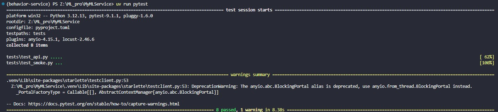
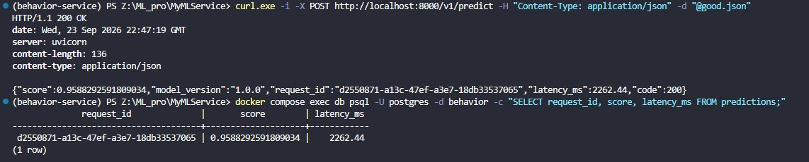
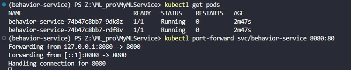
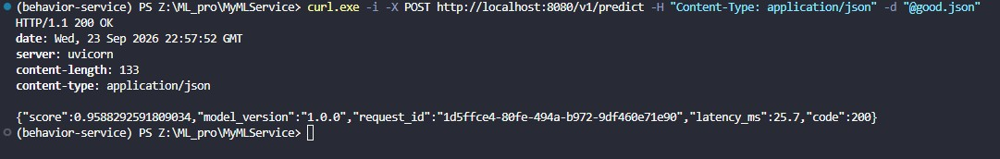
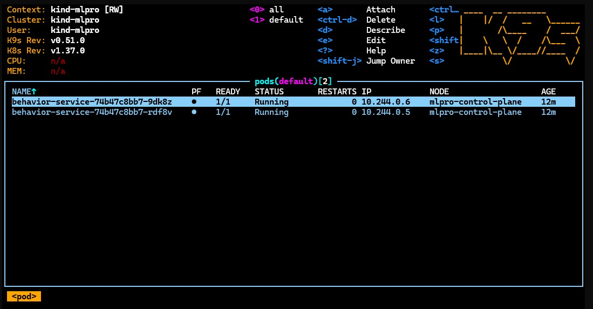

Команды для выполнения:

```bash
uv run pytest

docker compose up -d --build

curl.exe -i -X POST http://localhost:8000/v1/predict -H "Content-Type: application/json" -d "@good.json"

docker compose exec db psql -U postgres -d behavior -c "SELECT request_id, score, latency_ms FROM predictions;"

docker compose down

kind create cluster --name mlpro

kind load docker-image behavior-service:1.0 --name mlpro

kubectl apply -f k8s/

kubectl rollout status deploy/behavior-service

kubectl get pods

kubectl port-forward svc/behavior-service 8080:80

curl.exe -i -X POST http://localhost:8080/v1/predict -H "Content-Type: application/json" -d "@good.json"

k9s
```


# Pytest


# Select логов


# Kubernetes




